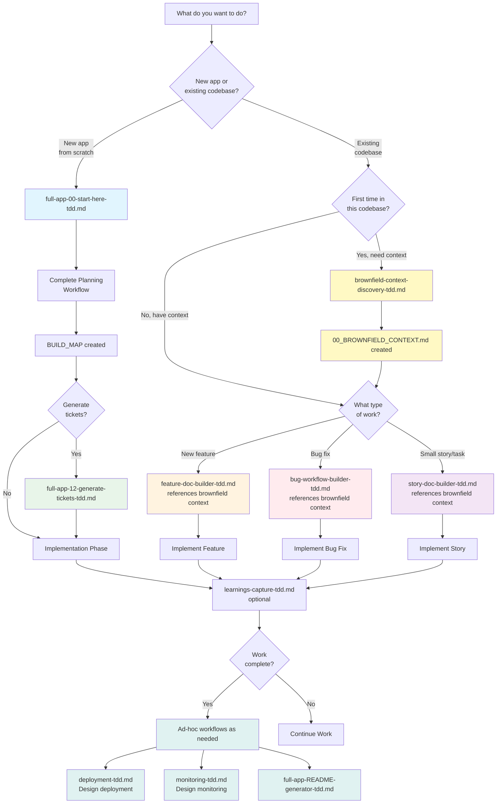

# Workflow Selector - Start Here 🚀

**Welcome to the AI-Toolkit! This guide helps you choose the right workflow for your task.**

---

## Quick Decision Tree

**What do you want to do?**

```
┌─ New complete application? ────────────→ full-app-00-start-here-tdd.md
│
├─ Working in existing codebase? ───────→ First time? Run brownfield-context-discovery-tdd.md
│                                         Then use workflows below:
│   ├─ Add feature? ──────────────────→ feature-doc-builder-tdd.md
│   ├─ Fix bug? ──────────────────────→ bug-workflow-builder-tdd.md
│   └─ Implement story? ──────────────→ story-doc-builder-tdd.md
│
├─ Generate tickets from specs? ─────────→ full-app-12-generate-tickets-tdd.md
│
├─ Capture learnings during work? ───────→ learnings-capture-tdd.md
│
├─ Design deployment? (TDD, ad-hoc) ─────→ deployment-tdd.md
│
├─ Design monitoring? (TDD, ad-hoc) ─────→ monitoring-tdd.md
│
├─ Generate README? (ad-hoc) ────────────→ full-app-README-generator-tdd.md
│
└─ Specialized workflows? ───────────────→ See "Specialized Workflows" below
```

---

## 1. Build a Complete New Application (Greenfield) 🆕

**Use**: `full-app-00-start-here-tdd.md`

**When to use**:
- Starting from scratch, no existing codebase
- Building a complete application with planning docs
- Need architecture, data model, API design, testing strategy

**Examples**:
- "Build a new user authentication service"
- "Create a task management API from scratch"
- "Build a React dashboard application"

**What you get**:
- Complete planning documentation (PRD, Architecture, Data Model, API, Security, Testing)
- Milestone-based BUILD_MAP
- AI-assisted implementation guidance
- Quality gates and testing strategy
- Optional ticket generation for Linear/GitHub/Jira

**Next step**: Run `full-app-00-start-here-tdd.md`

---

## 2. Work with Existing Codebase (Brownfield) 🔧

**IMPORTANT**: Brownfield context discovery is a **foundational prerequisite** for ALL work in existing codebases, not just features.

### When You're Working in an Existing Codebase

**First Time in This Codebase?**
- Run `brownfield-context-discovery-tdd.md` FIRST (20-40 min)
- This discovers:
  - Existing patterns, architecture, tech stack
  - High-risk areas to avoid
  - Testing patterns and quality baselines
  - Integration points and dependencies
- Creates `/specs/00_BROWNFIELD_CONTEXT.md`
- **This context is referenced by ALL other workflows** (features, bugs, stories)

**Already Have Brownfield Context?**
- Proceed directly to your workflow (feature, bug, story)
- Each workflow will reference your brownfield context
- Update context if you discover new patterns

### Then Choose Your Work Type:

**Adding a Feature?** → `feature-doc-builder-tdd.md`
- Plans feature following existing patterns
- Identifies files to create/modify
- Ensures consistency with codebase
- References 00_BROWNFIELD_CONTEXT.md

**Fixing a Bug?** → `bug-workflow-builder-tdd.md`
- Analyzes bug in context of existing code
- Uses existing error handling patterns
- Ensures no regressions in existing tests
- References 00_BROWNFIELD_CONTEXT.md

**Implementing a Story?** → `story-doc-builder-tdd.md`
- Small tasks in existing codebase
- Follows existing conventions
- Identifies touchpoints in existing code
- References 00_BROWNFIELD_CONTEXT.md

**Why This Matters**:
- Prevents breaking existing functionality
- Ensures consistency with codebase patterns
- Identifies high-risk areas before making changes
- Documents quality baselines (coverage, linter)
- Saves time by reusing existing utilities

---

## 3. Fix a Bug 🐛

**Use**: `bug-workflow-builder-tdd.md`

**When to use**:
- Broken functionality needs fixing
- Issue reported by user or tests
- Need systematic debugging approach

**Examples**:
- "Login button doesn't work on mobile"
- "API returns 500 error for certain inputs"
- "Dashboard shows incorrect data"

**What you get**:
- Structured bug investigation (symptom → root cause → fix)
- Test cases to verify fix
- Regression prevention strategy
- Documentation of root cause

**Next step**: Run `bug-workflow-builder-tdd.md`

---

## 4. Implement a User Story/Task 📝

**Use**: `story-doc-builder-tdd.md`

**When to use**:
- Small, single-responsibility task
- Already have high-level plan (from feature or milestone)
- Need ad-hoc story documentation

**Examples**:
- "Add 'Forgot Password' button to login page"
- "Update footer copyright year"
- "Add validation to email field"

**What you get**:
- Story specification (STORY_<id>.md)
- Acceptance criteria
- Touch points in code
- Implementation approaches

**When NOT to use**:
- Trivial changes (< 15 min) - just implement directly
- Complex features - use feature-doc-builder-tdd.md instead
- Complete applications - use full-app workflow

**Next step**: Run `story-doc-builder-tdd.md`

---

## 5. Generate Tickets from Specs 🎫

**Use**: `full-app-12-generate-tickets-tdd.md`

**When to use**:
- After planning is complete (BUILD_MAP.md exists)
- Before or during implementation
- Want tickets in Linear/GitHub/Jira

**Prerequisites**:
- /specs/BUILD_MAP.md must exist
- Planning docs complete (PRD, Architecture, etc.)

**What you get**:
- User stories generated from milestones
- Pushed to Linear/GitHub/Jira via MCP
- Auto-generated acceptance criteria
- Dependency linking (blocks/blocked by)
- AI-assisted time estimates
- Traceability (TICKETS_CREATED.md)

**Platforms supported**:
- Linear (via Linear MCP) - RECOMMENDED
- GitHub Issues (via gh CLI or GitHub MCP)
- Jira (via Jira MCP if available)
- Export only (markdown + JSON + CSV)

**Next step**: Run `full-app-12-generate-tickets-tdd.md`

---

## 6. Capture Learnings During Work 📚

**Use**: `learnings-capture-tdd.md`

**When to use**:
- During implementation
- After solving tricky problems
- When discovering insights about tech/process

**What you get**:
- LEARNINGS.md file with structured insights
- Technical learnings (what worked, what didn't)
- Process learnings (workflow improvements)
- Root cause analysis
- Recommendations for future

**Why it matters**:
- Future projects benefit from past experience
- Avoid repeating mistakes
- Document "why" decisions were made
- Feed continuous improvement

**Next step**: Run `learnings-capture-tdd.md`

---

## 7. Design Deployment Infrastructure (TDD) 🚀

**Use**: `deployment-tdd.md`

**When to use**:
- Ad-hoc during planning phase
- Need to design deployment strategy
- Creating technical design document for deployment

**What you get** (Planning/Design Document):
- Platform selection with tradeoffs (Vercel, Render, AWS, etc.)
- CI/CD pipeline design
- Environment strategy (staging, production)
- Database deployment plan
- Secrets management approach
- Rollback procedures design
- **Output**: `/specs/DEPLOYMENT_TDD.md`

**Next step**: Run `deployment-tdd.md`

---

## 8. Design Monitoring Strategy (TDD) 📊

**Use**: `monitoring-tdd.md`

**When to use**:
- Ad-hoc during planning phase
- Need to design observability strategy
- Creating technical design document for monitoring

**What you get** (Planning/Design Document):
- Monitoring level selection (Basic/Production/Enterprise)
- Tool selection (Sentry, DataDog, etc.)
- Alerting rules design
- Dashboard design
- Incident response plan
- **Output**: `/specs/MONITORING_TDD.md`

**Next step**: Run `monitoring-tdd.md`

---

## 9. Generate README 📖

**Use**: `full-app-README-generator-tdd.md`

**When to use**:
- Ad-hoc/on-demand when code is complete
- Need user-facing documentation
- Ready to handoff or share

**What you get**:
- README.md with installation, usage, examples
- Auto-generated from specs and code
- Quick start guide
- API documentation references

**Next step**: Run `full-app-README-generator-tdd.md`

---

## 10. Specialized Workflows 🔬

For advanced/niche use cases, see `/specialized/` folder:

### Data Engineering
**`/specialized/data-lakehouse-builder.md`** (2362 lines)
- Build data lakehouse architecture
- Data ingestion, transformation, analytics
- For: Data engineers, analytics teams

### Network/Infrastructure
**`/specialized/network-flow-builder.md`** (3049 lines)
- Network flow analysis and design
- Packet routing, traffic analysis
- For: Network engineers, security teams

### DevOps/Platform
**`/specialized/devops-change-builder.md`** (1982 lines)
- Infrastructure and platform changes
- CI/CD updates, deployment configs
- For: DevOps engineers, SREs

### UI/UX Research
**`/specialized/ui-pattern-discovery.md`** (1568 lines)
- Discover UI patterns in existing codebase
- Component analysis, design system extraction
- For: Frontend developers, designers

---

## Workflow Comparison Table

| Workflow | Use Case | Prerequisite | Output | Typical Duration |
|----------|----------|--------------|--------|------------------|
| **full-app-00** | New complete app | None | Full planning docs + BUILD_MAP | 1-3 hours planning |
| **brownfield-context** | First time in codebase | Existing code | 00_BROWNFIELD_CONTEXT.md | 20-40 min |
| **feature-doc** | Add feature | Brownfield context (recommended) | FEATURE_<name>.md | 30-60 min |
| **bug-workflow** | Fix bug | Bug description | Bug analysis + fix plan | 15-45 min |
| **story-doc** | Small task | Story details | STORY_<id>.md | 10-20 min |
| **generate-tickets** | Create issues | BUILD_MAP.md | Tickets in Linear/GitHub/Jira | 15-30 min |
| **learnings-capture** | Document insights | During/after work | LEARNINGS.md | 10-20 min |
| **deployment-tdd** | Design deployment (TDD, ad-hoc) | None | DEPLOYMENT_TDD.md | 30-60 min |
| **monitoring-tdd** | Design monitoring (TDD, ad-hoc) | None | MONITORING_TDD.md | 30-60 min |
| **README-generator** | User docs (ad-hoc) | Code complete | README.md | 15-30 min |

---

## Decision Flowchart



---

## Common Scenarios

### Scenario A: "I'm building a new API from scratch"
1. Run `full-app-00-start-here-tdd.md` (choose nested or flat structure)
2. Complete planning docs (PRD, Architecture, Data Model, API, etc.)
3. Optionally run `full-app-12-generate-tickets-tdd.md` to push to Linear/GitHub/Jira
4. Implement milestones using `full-app-11-implement-milestone-n.md`
5. Capture learnings with `learnings-capture-tdd.md`
6. **Ad-hoc TDD**: Run `deployment-tdd.md` to design deployment infrastructure
7. **Ad-hoc TDD**: Run `monitoring-tdd.md` to design monitoring strategy
8. **Ad-hoc**: Run `full-app-README-generator-tdd.md` for user docs

### Scenario B: "I need to add login to my existing React app"
1. **First time in this codebase?** Run `brownfield-context-discovery-tdd.md` (creates 00_BROWNFIELD_CONTEXT.md)
2. Run `feature-doc-builder-tdd.md` for login feature (references brownfield context)
3. Implement following existing patterns discovered in Phase 0
4. Run ALL existing tests to ensure no regressions
5. Capture learnings with `learnings-capture-tdd.md`

### Scenario C: "I have a bug where users can't save their profile"
1. Run `bug-workflow-builder-tdd.md` (includes Phase 0: brownfield context check)
2. Follow symptom → root cause → fix workflow
3. Write regression test FIRST (TDD)
4. Implement fix following existing error handling patterns
5. Run ALL existing tests to ensure no regressions
6. Capture learnings about root cause

### Scenario D: "I just finished planning and want tickets in Linear"
1. Ensure `BUILD_MAP.md` exists in `/specs/`
2. Run `full-app-12-generate-tickets-tdd.md`
3. Choose Linear integration
4. Provide metadata (tags, sprint, assignee)
5. Tickets created with traceability in `TICKETS_CREATED.md`

### Scenario E: "I'm adding a small 'Delete' button to existing UI"
1. **Option A**: If trivial (< 15 min), just implement directly
2. **Option B**: If needs planning, run `story-doc-builder-tdd.md`

---

## Key Concepts

### Greenfield vs Brownfield
- **Greenfield**: New project from scratch → Use `full-app-00-start-here-tdd.md`
- **Brownfield**: Existing codebase → **ALWAYS** check for brownfield context first
  - First time in codebase: Run `brownfield-context-discovery-tdd.md`
  - Creates `/specs/00_BROWNFIELD_CONTEXT.md` (referenced by ALL workflows)
  - All workflows (feature, bug, story) include Phase 0 brownfield check
  - Prevents breaking existing code, ensures pattern consistency

### SPEC_PATH (Nested vs Flat)
- **Nested**: `/specs/TICKET-ID/` - For parallel team work
- **Flat**: `/specs/` - For solo developers
- Set in `full-app-00-start-here-tdd.md`, used by all subsequent commands

### Query-First Pattern
All workflows follow:
1. **Query**: Ask clarifying questions
2. **Options**: Present 2-4 options with tradeoffs
3. **Recommend**: Suggest best option with reasoning
4. **Confirm**: Wait for user approval
5. **Implement**: Execute with quality gates

### AI-Assisted Time Estimates
All estimates assume AI-assisted development (Claude, Cursor):
- 3-5x faster than manual coding
- Example: 2 hours AI-assisted = 6-10 hours manual
- See `AI_ASSISTED_TIME_ESTIMATES.md` for details

---

## Documentation Guides

For deeper understanding, see these guides:

| Guide | Purpose | Lines |
|-------|---------|-------|
| **ARCHITECTURE_PRINCIPLES_GUIDE.md** | SOLID principles, best practices | 534 |
| **TICKET_GENERATION_GUIDE.md** | Complete ticket generation reference | 1075 |
| **AI_ASSISTED_TIME_ESTIMATES.md** | Understanding AI speedup factors | 318 |
| **NESTED_SPECS_STRUCTURE.md** | Using nested folder structure | 219 |
| **QUERY_FIRST_PATTERN.md** | Query-first workflow pattern | 404 |
| **WORKFLOW_UPDATES_SUMMARY.md** | Summary of all workflow updates | 484 |
| **DOCUMENTATION_REVIEW_ANALYSIS.md** | Analysis of all documentation | ~700 |
| **CLEANUP_ACTION_PLAN.md** | Cleanup actions taken | ~300 |

---

## Still Confused?

### "Should I use full-app or feature-doc-builder?"

**Use full-app** if:
- ✅ Starting from scratch (no code exists)
- ✅ Need complete planning (PRD, architecture, data model, etc.)
- ✅ Building a complete application or service

**Use feature-doc-builder** if:
- ✅ Code already exists
- ✅ Adding capability to existing app
- ✅ Want to follow existing patterns

### "Should I use feature or story?"

**Use feature-doc-builder** if:
- ✅ Substantial new capability (> 1 hour work)
- ✅ Multiple acceptance criteria
- ✅ Touches multiple files or layers

**Use story-doc-builder** if:
- ✅ Small, focused task (< 1 hour work)
- ✅ Single responsibility
- ✅ Part of larger feature or milestone

**Don't use either** if:
- ⚠️ Trivial change (< 15 min) - just implement directly

### "When should I generate tickets?"

**Generate tickets** if:
- ✅ Working with team (need visibility)
- ✅ Planning sprints/cycles
- ✅ Want dependency tracking
- ✅ Using Linear/GitHub/Jira

**Don't generate tickets** if:
- ⚠️ Solo developer with no need for formal tracking
- ⚠️ Rapid prototyping / throwaway code

---

## Need Help?

1. **Start here**: Read this file (00-WORKFLOW-SELECTOR.md)
2. **Review patterns**: See QUERY_FIRST_PATTERN.md
3. **Check guides**: See documentation guides above
4. **Still stuck?** Pick the closest workflow and run it - the AI will guide you

---

## Workflow File Naming

- `full-app-XX-*`: Complete app workflow steps (00-12)
- `*-builder`: Generate planning documents
- `*-discovery`: Analyze existing code
- `*-capture`: Document learnings/insights
- `*-generator`: Generate user-facing docs
- `00-*`: Entry points and selectors

---

**Last Updated**: 2026-01-02
**Version**: 2.0 (with ticket generation, SOLID principles, infrastructure decisions)

**Next Action**: Choose your workflow above and run the corresponding .md file!
