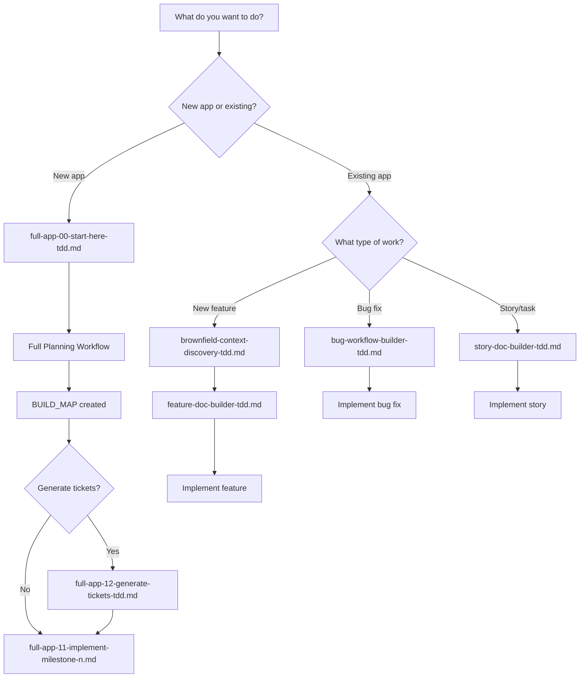

# Documentation Cleanup - Action Plan

**Date**: 2026-01-02
**Status**: Partially Complete (2/4 deletions done)

---

## Completed Actions ✅

### 1. Deleted Minimal Files (DONE)
- ✅ **refactor-gate.md** (6 lines) - DELETED
- ✅ **verify-only.md** (38 lines) - DELETED
- ✅ **story-doc-builder-tdd.md** - KEPT (has use case for ad-hoc story generation)

**Impact**: -44 lines, cleaner file list

---

## Remaining Actions

### Priority 1: Remove Duplication (HIGH IMPACT)

#### Action 1.1: Delete Outdated Entry Point
```bash
# Delete full-app-flow-selection.md
rm E:\_projects\ai-toolkit\cursor\commands\full-app-flow-selection.md
```

**Reason**: Replaced by `full-app-00-start-here-tdd.md` (which has SPEC_PATH, nested structure, SOLID, infrastructure)

**Impact**: -87 lines

---

#### Action 1.2: Merge Learnings Review
```bash
# Manual merge required - steps:
1. Read learnings-review.md
2. Identify unique content not in full-app-completion-summary-tdd.md
3. Add unique content to full-app-completion-summary-tdd.md
4. Delete learnings-review.md
```

**Reason**: Both files deal with reviewing learnings - consolidate into completion summary

**Impact**: -396 lines (after merge)

---

### Priority 2: Add Missing Entry Point (HIGH IMPACT)

#### Action 2.1: Create Workflow Selector
```
✅ CREATE: 00-WORKFLOW-SELECTOR.md (~200 lines)
```

**Content**:
- Decision tree: "What do you want to do?"
- Clear use case definitions (full-app vs feature vs bug vs story)
- Quick reference table
- Flowchart (Mermaid diagram)

**Template**:
```markdown
# Workflow Selector - Start Here

**What do you want to do?**

## 1. Build a Complete New Application (Greenfield)
- **Use**: `full-app-00-start-here-tdd.md`
- **When**: Starting from scratch, no existing codebase
- **Example**: "Build a new user authentication service"

## 2. Add Feature to Existing Application (Brownfield)
- **Use**: `brownfield-context-discovery-tdd.md` → `feature-doc-builder-tdd.md`
- **When**: Existing codebase, adding new capability
- **Example**: "Add password reset to existing auth service"

## 3. Implement a User Story
- **Use**: `story-doc-builder-tdd.md`
- **When**: Small, single-responsibility task
- **Example**: "Add 'Forgot Password' button to login page"

## 4. Fix a Bug
- **Use**: `bug-workflow-builder-tdd.md`
- **When**: Broken functionality needs fixing
- **Example**: "Login button doesn't work on mobile"

## 5. Generate Tickets from Specs
- **Use**: `full-app-12-generate-tickets-tdd.md`
- **When**: After planning is complete, before implementation
- **Example**: Push milestones to Linear/GitHub/Jira

## 6. Capture Learnings
- **Use**: `learnings-capture-tdd.md`
- **When**: During implementation, capture insights
- **Example**: "Document why we chose React over Vue"

## 7. Specialized Workflows
- **Data Lakehouse**: `/specialized/data-lakehouse-builder.md`
- **Network Flow**: `/specialized/network-flow-builder.md`
- **DevOps Changes**: `/specialized/devops-change-builder.md`
- **UI Pattern Discovery**: `/specialized/ui-pattern-discovery.md`

## Flowchart



## Quick Reference

| Task | Command File | Prerequisites |
|------|-------------|---------------|
| Full app (new) | full-app-00-start-here-tdd.md | None |
| Feature (existing) | brownfield-context-discovery-tdd.md | Existing codebase |
| Bug fix | bug-workflow-builder-tdd.md | Bug description |
| User story | story-doc-builder-tdd.md | Story details |
| Generate tickets | full-app-12-generate-tickets-tdd.md | BUILD_MAP.md exists |
| Capture learnings | learnings-capture-tdd.md | During implementation |
| README generator | full-app-README-generator-tdd.md | Code complete |
```

**Impact**: Massive reduction in user confusion, clear entry point

---

### Priority 3: Organize Specialized Workflows (MEDIUM IMPACT)

#### Action 3.1: Create Specialized Folder
```bash
# Create folder
mkdir E:\_projects\ai-toolkit\cursor\commands\specialized

# Move specialized workflows
mv E:\_projects\ai-toolkit\cursor\commands\data-lakehouse-builder.md ./specialized/
mv E:\_projects\ai-toolkit\cursor\commands\network-flow-builder.md ./specialized/
mv E:\_projects\ai-toolkit\cursor\commands\devops-change-builder.md ./specialized/
mv E:\_projects\ai-toolkit\cursor\commands\ui-pattern-discovery.md ./specialized/
```

**Reason**: These 4 files are 9,961 lines (55% of all docs) and very niche

**Impact**: Main folder cleaner (37 → 33 files in main, 4 in specialized)

---

### Priority 4: Optional - Create Missing Workflows (LOW-MEDIUM IMPACT)

These are **OPTIONAL** - only create if needed:

#### Action 4.1: Migration Workflow (OPTIONAL)
```
✅ CREATE: migration-workflow.md (~200 lines)
```

**Content**:
- Upgrading dependencies (npm, pip, etc.)
- Database migrations (Alembic, Prisma, etc.)
- API versioning and deprecation
- Legacy code refactoring

---

#### Action 4.2: Code Review Checklist (OPTIONAL)
```
✅ CREATE: code-review-checklist.md (~150 lines)
```

**Content**:
- SOLID principles check
- Security review (OWASP Top 10)
- Performance review
- Test coverage review
- Documentation review

---

#### Action 4.3: Deployment Workflow (OPTIONAL)
```
✅ CREATE: deployment-workflow.md (~300 lines)
```

**Content**:
- Pre-deployment checklist
- Platform-specific deployment steps (AWS, Vercel, Railway, etc.)
- Post-deployment verification
- Rollback procedures
- Monitoring setup

---

#### Action 4.4: Monitoring Setup (OPTIONAL)
```
✅ CREATE: monitoring-setup.md (~200 lines)
```

**Content**:
- Logging setup (Sentry, CloudWatch, etc.)
- Metrics dashboards (Grafana, DataDog)
- Alerts and notifications
- Incident response playbook

---

## Implementation Order

### Phase 1: Quick Wins (30 min)
1. ✅ Delete `full-app-flow-selection.md`
2. ✅ Delete `learnings-review.md` (after merging unique content)

**Result**: -483 lines, no duplication

---

### Phase 2: Entry Point (1 hour)
3. ✅ Create `00-WORKFLOW-SELECTOR.md`

**Result**: Clear navigation, reduced confusion

---

### Phase 3: Organization (15 min)
4. ✅ Create `/specialized/` folder
5. ✅ Move 4 specialized workflows

**Result**: Cleaner main folder (33 files)

---

### Phase 4: Optional Workflows (2-4 hours)
6. ⚠️ Create missing workflows (migration, code review, deployment, monitoring) - ONLY IF NEEDED

**Result**: Fills gaps in workflow coverage

---

## Before vs After

### Before Cleanup
- **Files**: 37 (all in one folder)
- **Entry points**: 2 (confusing - full-app-flow-selection.md vs full-app-00-start-here-tdd.md)
- **Duplication**: Yes (learnings-review.md overlaps completion-summary.md)
- **Minimal files**: 3 files < 50 lines with unclear value
- **Organization**: All workflows mixed together
- **Navigation**: None - user must guess which file to use

### After Cleanup (Minimum - Phase 1-3)
- **Files**: 33 main + 4 specialized = 37 total
- **Entry points**: 1 clear (00-WORKFLOW-SELECTOR.md)
- **Duplication**: None
- **Minimal files**: 0 (deleted refactor-gate.md, verify-only.md)
- **Organization**: Main vs specialized folders
- **Navigation**: Clear decision tree in workflow selector

### After Cleanup (With Optional - Phase 1-4)
- **Files**: 37 main + 4 specialized = 41 total
- **Entry points**: 1 clear (00-WORKFLOW-SELECTOR.md)
- **Duplication**: None
- **Minimal files**: 0
- **Organization**: Main vs specialized folders
- **Navigation**: Clear decision tree + all gaps filled
- **New capabilities**: Migration, code review, deployment, monitoring workflows

---

## User Decisions Made

Based on user feedback:

1. ✅ **Do NOT split long guides** (AI handles them fine)
   - TICKET_GENERATION_GUIDE.md stays at 1,075 lines
   - ARCHITECTURE_PRINCIPLES_GUIDE.md stays at 534 lines

2. ✅ **Keep story-doc-builder-tdd.md** (has use case for ad-hoc story generation)

3. ✅ **Delete refactor-gate.md** (6 lines, not useful) - DONE

4. ✅ **Delete verify-only.md** (38 lines, not useful) - DONE

5. ✅ **Nested structure works in Claude** (no concerns)

---

## Next Steps

**Recommend doing in order**:

1. **Immediate** (do now):
   - Delete `full-app-flow-selection.md`
   - Merge & delete `learnings-review.md`

2. **High Priority** (do soon):
   - Create `00-WORKFLOW-SELECTOR.md`

3. **Medium Priority** (do when time permits):
   - Move specialized workflows to `/specialized/` folder

4. **Low Priority** (optional - only if needed):
   - Create missing workflows (migration, code review, deployment, monitoring)

---

## Estimated Time

- **Phase 1 (Quick Wins)**: 30 minutes
- **Phase 2 (Entry Point)**: 1 hour
- **Phase 3 (Organization)**: 15 minutes
- **Phase 4 (Optional)**: 2-4 hours

**Total (Phases 1-3)**: ~1.75 hours for massive improvement in usability

---

**Last Updated**: 2026-01-02
**Status**: ✅ ALL PRIORITY 1 TASKS COMPLETE + Deployment & Monitoring workflows added
**Completed**:
- ✅ Deleted full-app-flow-selection.md
- ✅ Merged and deleted learnings-review.md
- ✅ Created 00-WORKFLOW-SELECTOR.md
- ✅ Moved specialized workflows to /specialized/ folder
- ✅ Created deployment-workflow.md (ad-hoc)
- ✅ Created monitoring-setup.md (ad-hoc)
