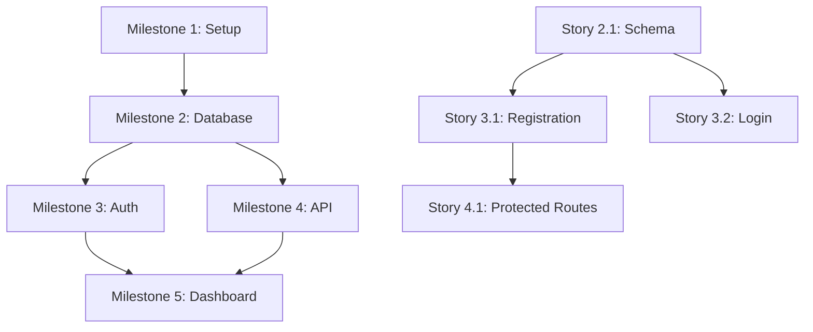

# Ticket Generation from Specs - Complete Guide

## Overview

The `full-app-12-generate-tickets-tdd.md` command automatically generates tickets/issues from your planning specs and pushes them to your ticketing system (Linear, GitHub Issues, Jira, etc.) via MCP.

**Key Features**:
- ✅ Intelligent story breakdown (1 story to 6+ stories with subtasks based on size)
- ✅ Multi-platform support (Linear, GitHub, Jira, or export-only)
- ✅ Auto-generated acceptance criteria from specs
- ✅ Dependency linking (blocks/blocked by relationships)
- ✅ AI-assisted time estimates included
- ✅ Fully customizable metadata (tags, sprints, assignments)
- ✅ Traceability (links specs to created tickets)
- ✅ Update existing tickets when specs change

---

## When to Use This Command

### Recommended Timing

**BEST**: After PLAN_APPROVAL_GATE (full-app-10a)
- All specs are finalized and approved
- BUILD_MAP milestones are clearly defined
- Gives team full visibility before coding starts

**GOOD**: After BUILD_MAP completion (full-app-10)
- Milestones are defined
- Can create tickets before final approval

**ACCEPTABLE**: During implementation
- Create tickets incrementally after each milestone
- Useful for agile/iterative workflows

**NOT RECOMMENDED**: Before BUILD_MAP exists
- Nothing to generate tickets from
- Wait until planning is complete

---

## How It Works

### 10-Step Process

```
┌─────────────────────────────────────────────────────────────┐
│ STEP 1: Detect SPEC_PATH                                    │
│ Read /specs/ or /specs/TICKET-ID/ from 00_START_HERE.md    │
└─────────────────────────────────────────────────────────────┘
                           ↓
┌─────────────────────────────────────────────────────────────┐
│ STEP 2: Load All Spec Files                                 │
│ Read BUILD_MAP, PRD, ARCHITECTURE, DATA_MODEL, etc.         │
└─────────────────────────────────────────────────────────────┘
                           ↓
┌─────────────────────────────────────────────────────────────┐
│ STEP 3: Parse Milestones                                    │
│ Extract milestones, estimates, dependencies from BUILD_MAP  │
└─────────────────────────────────────────────────────────────┘
                           ↓
┌─────────────────────────────────────────────────────────────┐
│ STEP 4: Generate User Stories                               │
│ Auto-detect breakdown strategy based on milestone size      │
│ - Small (< 1hr): 1 story per milestone                      │
│ - Medium (1-3hr): 2-4 stories per milestone                 │
│ - Large (> 3hr): 3-6 stories with subtasks                  │
└─────────────────────────────────────────────────────────────┘
                           ↓
┌─────────────────────────────────────────────────────────────┐
│ STEP 5: Generate Preview (Markdown)                         │
│ Create TICKETS_PREVIEW.md for user review                   │
│ Wait for approval before creating actual tickets            │
└─────────────────────────────────────────────────────────────┘
                           ↓
┌─────────────────────────────────────────────────────────────┐
│ STEP 6: Query Integration Target                            │
│ Ask: Linear, GitHub, Jira, Export Only, or Multiple?        │
└─────────────────────────────────────────────────────────────┘
                           ↓
┌─────────────────────────────────────────────────────────────┐
│ STEP 7: Query Metadata (one question at a time)             │
│ - Tags/labels                                                │
│ - Sprint/cycle assignment                                    │
│ - User assignment                                            │
│ - Priority                                                   │
│ - Team assignment (if applicable)                            │
│ - Custom fields (if applicable)                              │
└─────────────────────────────────────────────────────────────┘
                           ↓
┌─────────────────────────────────────────────────────────────┐
│ STEP 8: Create Tickets via MCP/API                          │
│ - Create milestones (parent tickets)                         │
│ - Create user stories (child issues)                         │
│ - Create subtasks (if hybrid breakdown)                      │
│ - Link dependencies (blocks/blocked by)                      │
└─────────────────────────────────────────────────────────────┘
                           ↓
┌─────────────────────────────────────────────────────────────┐
│ STEP 9: Save Ticket References                              │
│ Create TICKETS_CREATED.md with IDs and URLs for traceability│
└─────────────────────────────────────────────────────────────┘
                           ↓
┌─────────────────────────────────────────────────────────────┐
│ STEP 10: Confirmation Message                               │
│ Show summary with links to created tickets                  │
└─────────────────────────────────────────────────────────────┘
```

---

## Story Breakdown Strategies

### Auto-Detection Based on Milestone Size

The command automatically chooses the best breakdown strategy:

#### Strategy 1: Single Story (Small Milestone < 1 hour)

```
Milestone 1: Project Setup & Environment (15-25 min)
└── Story 1.1: Set up project environment (15-25 min)
```

**When used**: Simple, quick milestones
**Benefits**: Minimal overhead, easy to track

---

#### Strategy 2: Feature-Based (Medium Milestone 1-3 hours)

```
Milestone 3: User Authentication (2-3 hours)
├── Story 3.1: User Registration (45-60 min)
├── Story 3.2: User Login (30-45 min)
└── Story 3.3: Password Reset (30-45 min)
```

**When used**: Multiple distinct features in milestone
**Benefits**: Each story is independently valuable
**Breakdown logic**: Split by feature from PRD acceptance criteria

---

#### Strategy 3: Hybrid with Subtasks (Large Milestone > 3 hours)

```
Milestone 5: Dashboard with Real-time Updates (4-6 hours)
├── Story 5.1: Dashboard Data API (1.5-2 hours)
│   ├── Subtask: Design GraphQL schema
│   ├── Subtask: Implement resolvers
│   └── Subtask: Write API tests
├── Story 5.2: Dashboard UI Components (1.5-2 hours)
│   ├── Subtask: Create dashboard layout
│   ├── Subtask: Build data visualization widgets
│   └── Subtask: Write component tests
└── Story 5.3: Real-time WebSocket Integration (1-2 hours)
    ├── Subtask: Set up WebSocket server
    ├── Subtask: Implement client-side listeners
    └── Subtask: Write integration tests
```

**When used**: Complex milestones with multiple layers (frontend, backend, integration)
**Benefits**: Granular tracking, clear technical tasks
**Breakdown logic**:
- Stories = features
- Subtasks = technical layers (API, UI, Tests)

---

## Platform-Specific Details

### Linear (via Linear MCP)

**Advantages**:
- ✅ Native milestone support (CRUD operations)
- ✅ Issues automatically link to parent milestones
- ✅ Dependency relationships (blocks/blocked by)
- ✅ Cycles for sprint planning
- ✅ Custom fields support
- ✅ Team assignment
- ✅ Estimate points

**Ticket Structure**:
```
Linear Milestone (parent)
├── Linear Issue (story 1) → linked to milestone
├── Linear Issue (story 2) → linked to milestone
└── Linear Issue (story 3) → linked to milestone
    └── Checklist items (subtasks) OR child issues
```

**Metadata Collected**:
- Tags/labels (e.g., `backend`, `frontend`, `sprint-5`)
- Cycle assignment (e.g., "2025 Q1 - Week 1")
- Assignee (Linear username or email)
- Priority (Urgent/High/Medium/Low)
- Team (if multi-team workspace)
- Custom fields (e.g., customer impact, risk level)

**Dependencies**:
- Uses Linear's native "Blocks" relationship
- Story 3.1 blocks Story 4.1 → creates link in Linear

**Example Linear Issue**:
```
Title: [M3.1] User Registration

Description:
**As a** new user
**I want to** register with email and password
**So that** I can access the application

**Acceptance Criteria**:
- [ ] User can enter email and password
- [ ] Password must be at least 8 characters
- [ ] User receives confirmation email
- [ ] Invalid emails are rejected

**Technical Details**:
- API: POST /api/auth/register
- Database: users table (email, password_hash)
- Security: bcrypt password hashing

**Estimate**: 45-60 min (AI-assisted)

Labels: milestone-3, feature, backend, auth
Milestone: Milestone 3: User Authentication
Assignee: @developer
Priority: High
Cycle: 2025 Q1 - Week 2
```

---

### GitHub Issues (via gh CLI or GitHub MCP)

**Advantages**:
- ✅ Native milestone support
- ✅ Labels for categorization
- ✅ Issue references for dependencies (#123)
- ✅ Projects integration (Kanban boards)
- ✅ Free for public/private repos

**Ticket Structure**:
```
GitHub Milestone (native milestone object)
├── GitHub Issue #101 (story 1) → assigned to milestone
├── GitHub Issue #102 (story 2) → assigned to milestone
└── GitHub Issue #103 (story 3) → assigned to milestone
    └── Task list (subtasks) in issue body
```

**Metadata Collected**:
- Labels (e.g., `backend`, `frontend`, `priority:high`)
- Milestone assignment
- Assignee (GitHub username)
- Project board (optional)

**Dependencies**:
- Uses issue references in description
- "Blocks #102" → mentioned in Story 3.1 description
- "Blocked by #101" → mentioned in Story 3.2 description

**Example GitHub Issue**:
```markdown
Title: [M3.1] User Registration

Labels: milestone-3, feature, backend, auth
Milestone: Milestone 3: User Authentication
Assignee: @developer

---

**As a** new user
**I want to** register with email and password
**So that** I can access the application

## Acceptance Criteria
- [ ] User can enter email and password
- [ ] Password must be at least 8 characters
- [ ] User receives confirmation email
- [ ] Invalid emails are rejected

## Technical Details
- **API**: POST /api/auth/register
- **Database**: users table (email, password_hash)
- **Security**: bcrypt password hashing

## Estimate
45-60 min (AI-assisted)

## Dependencies
- Blocks #102 (User Login depends on registration table)
- Blocked by #100 (Database setup must be complete)

## Tasks
- [ ] Create registration API endpoint
- [ ] Implement password hashing
- [ ] Send welcome email
- [ ] Write API tests
```

---

### Jira (via Jira MCP if available)

**Advantages**:
- ✅ Epic/Story/Subtask hierarchy
- ✅ Sprint assignment
- ✅ Custom fields and workflows
- ✅ Enterprise features (reports, dashboards)

**Ticket Structure**:
```
Jira Epic (milestone)
├── Jira Story (user story 1) → linked to epic
│   ├── Jira Subtask (technical task 1)
│   └── Jira Subtask (technical task 2)
├── Jira Story (user story 2) → linked to epic
└── Jira Story (user story 3) → linked to epic
```

**Metadata Collected**:
- Issue type (Epic, Story, Subtask)
- Labels
- Sprint assignment
- Assignee
- Priority
- Custom fields (e.g., story points, customer impact)

**Dependencies**:
- Uses Jira's native "blocks" link type

---

### Export Only (No Integration)

**Advantages**:
- ✅ No MCP/API required
- ✅ Review tickets before creating
- ✅ Import manually or via CSV
- ✅ Platform-agnostic

**Outputs**:
1. **TICKETS.md**: Full markdown preview
2. **TICKETS.json**: Structured JSON for programmatic import
3. **TICKETS.csv**: Spreadsheet format for manual import

**Example JSON**:
```json
{
  "generated": "2026-01-02T12:00:00Z",
  "spec_path": "/specs/AUTH-101/",
  "project": "User Authentication Feature",
  "milestones": [
    {
      "id": "M3",
      "title": "User Authentication",
      "description": "Implement user registration, login, and password reset",
      "estimate_hours": "2-3",
      "dependencies": ["M2"],
      "stories": [
        {
          "id": "M3.1",
          "title": "User Registration",
          "user_type": "new user",
          "action": "register with email and password",
          "benefit": "can access the application",
          "acceptance_criteria": [
            "User can enter email and password",
            "Password must be at least 8 characters",
            "User receives confirmation email"
          ],
          "technical_details": {
            "api": "POST /api/auth/register",
            "database": "users table (email, password_hash)",
            "security": "bcrypt password hashing"
          },
          "dependencies": {
            "blocks": ["M4.1"],
            "blocked_by": ["M2.1"]
          },
          "estimate_hours": "0.75-1",
          "tags": ["milestone-3", "feature", "backend", "auth"],
          "priority": "high",
          "subtasks": []
        }
      ]
    }
  ],
  "summary": {
    "total_milestones": 8,
    "total_stories": 15,
    "total_subtasks": 0,
    "total_estimate_hours": "6-11"
  }
}
```

---

## User Story Format

Every generated user story follows this structure:

### Title
```
[M{milestone}.{story}] {Feature Name}
```
Example: `[M3.1] User Registration`

### Description (Classic Agile)
```markdown
**As a** {user type from PRD}
**I want to** {action/capability}
**So that** {benefit/value}
```

### Acceptance Criteria
```markdown
**Acceptance Criteria**:
- [ ] {Criterion 1 from PRD or BUILD_MAP}
- [ ] {Criterion 2}
- [ ] {Criterion 3}
- [ ] Quality gate: All tests pass
- [ ] Quality gate: Linter passes
```

### Technical Details
```markdown
**Technical Details**:
- **Architecture**: {Relevant info from 02_ARCHITECTURE.md}
- **Database**: {Schema changes from 03_DATA_MODEL.md}
- **API**: {Endpoints from 04_API_CONTRACT.md}
- **Security**: {Requirements from 07_SECURITY_NFR.md}
- **Files to modify/create**: {Estimated file list}
```

### Dependencies
```markdown
**Dependencies**:
- **Blocks**: Story 4.1, Story 5.2
- **Blocked by**: Story 2.1 (Database setup)
- **Related to**: Milestone 2 (prerequisite)
```

### Estimate
```markdown
**Estimate**:
- **AI-assisted**: 45-60 min
- **Manual equivalent**: 3-5 hours (4x slower)
- **Complexity**: Moderate
```

### Tags (Auto-Generated)
```markdown
**Tags**:
- `milestone-3` (auto-generated from milestone number)
- `feature` (auto-detected from type of work)
- `backend` (auto-detected from technical details)
- `auth` (auto-detected from feature domain)
- `sprint-5` (user-specified custom tag)
- `high-priority` (user-specified custom tag)
```

---

## Dependency Auto-Linking

### How Dependencies Are Detected

**1. Explicit Dependencies (from BUILD_MAP)**:
```markdown
MILESTONE 3: User Authentication
- Dependencies: Milestone 2 (Database Setup) must be complete
```
→ All stories in M3 are "blocked by" all stories in M2

**2. Implicit Dependencies (from Technical Details)**:
```markdown
Story 3.1: Uses user table from Story 2.1
Story 4.1: Requires authentication from Story 3.2
```
→ Story 3.1 "blocked by" Story 2.1
→ Story 4.1 "blocked by" Story 3.2

**3. Sequential Dependencies (default)**:
```markdown
M1 → M2 → M3 → M4
```
→ M2 blocked by M1, M3 blocked by M2, etc.

### Dependency Graph Visualization

Generated in TICKETS_PREVIEW.md:



---

## Metadata Collection (Step-by-Step)

### Question 1: Labels/Tags

**Prompt**: "What additional labels/tags should be applied to all tickets?"

**Context**: Auto-generated tags already include:
- `milestone-{N}`
- Tech stack (e.g., `python`, `react`, `fastapi`)
- Area (e.g., `backend`, `frontend`, `database`)
- Type (e.g., `feature`, `bug`, `chore`)

**User Input**: Comma-separated list or "none"

**Examples**:
- `sprint-5, high-priority, needs-review`
- `team-alpha, customer-facing`
- `technical-debt, refactor`
- `none` (use only auto-generated tags)

---

### Question 2: Sprint/Cycle Assignment

**Prompt**: "Should these tickets be assigned to a sprint/cycle?"

**Options**:
- **Specify sprint**: "Sprint 5" or "2025 Q1 - Week 2"
- **Backlog**: "backlog" (no sprint assignment)
- **Per milestone**: "ask" (different sprints for different milestones)

**Platform-Specific**:
- **Linear**: Cycle name or ID (e.g., "2025 Q1 - Week 2")
- **GitHub**: Project or milestone (GitHub doesn't have sprints)
- **Jira**: Sprint name (e.g., "Sprint 5")

**Example**:
- User: `Sprint 5`
- Result: All tickets assigned to Sprint 5

---

### Question 3: User Assignment

**Prompt**: "Should these tickets be assigned to specific users?"

**Options**:
- **Assign all to one user**: "@developer" or "john@company.com"
- **Unassigned**: "unassigned" (assign later)
- **Per milestone**: "ask" (different owners for different milestones)
- **Team**: "team-alpha" (if platform supports teams)

**Example**:
- User: `@alice`
- Result: All tickets assigned to Alice

---

### Question 4: Priority

**Prompt**: "What priority should these tickets have?"

**Options**:
- **Derive from complexity**: "auto" (Simple=Low, Moderate=Medium, Complex=High, Very Complex=Urgent)
- **Set all to same priority**: "high", "medium", "low", "urgent"
- **Per milestone**: "ask" (different priorities for different milestones)

**Default**: "auto" (recommended)

**Example**:
- User: `auto`
- Result:
  - Milestone 1 (Simple) → Priority: Low
  - Milestone 3 (Moderate) → Priority: Medium
  - Milestone 5 (Complex) → Priority: High

---

### Question 5: Team Assignment (if applicable)

**Prompt**: "Should these tickets be assigned to a specific team?"

**Only asked if platform supports teams** (Linear, Jira)

**Options**:
- **Assign to team**: "team-alpha"
- **No team**: "none"

**Example**:
- User: `team-backend`
- Result: All tickets assigned to Backend team

---

### Question 6: Custom Fields (if applicable)

**Prompt**: "Are there any custom fields to set?"

**Only asked if platform supports custom fields** (Linear, Jira)

**Format**: `field_name:value, field_name2:value2`

**Examples**:
- `customer_impact:high, technical_debt:low`
- `risk_level:medium, effort:small`
- `none` (no custom fields)

**Linear Custom Fields**:
- Customer Impact (Low/Medium/High)
- Technical Debt (Low/Medium/High)
- Risk Level (Low/Medium/High)
- Business Value (1-10)

---

## Files Generated

### TICKETS_PREVIEW.md

**Purpose**: Preview all tickets before creating them

**Location**: `${SPEC_PATH}TICKETS_PREVIEW.md`

**Contents**:
- Project overview
- All milestones with descriptions
- All user stories with full details
- Dependency graph (Mermaid diagram)
- Summary statistics

**Example**:
```markdown
# Ticket Generation Preview

**Project**: User Authentication Feature
**SPEC_PATH**: /specs/AUTH-101/
**Total Milestones**: 3
**Total Stories**: 7
**Generated**: 2026-01-02 12:00:00

---

## Milestone 3: User Authentication (Parent Ticket)

**Description**: Implement user registration, login, and password reset
**Estimate**: 2-3 hours AI-assisted
**Dependencies**: Milestone 2 (Database Setup)
**Tags**: `milestone`, `milestone-3`, `backend`, `auth`

### Story 3.1: User Registration

**As a** new user
**I want to** register with email and password
**So that** I can access the application

**Acceptance Criteria**:
- [ ] User can enter email and password
- [ ] Password must be at least 8 characters
- [ ] User receives confirmation email

**Technical Details**:
- **API**: POST /api/auth/register
- **Database**: users table
- **Files**: src/api/auth.py, src/models/user.py

**Dependencies**:
- Blocked by: Story 2.1 (Database schema)
- Blocks: Story 4.1 (Protected routes)

**Estimate**: 45-60 min AI-assisted
**Tags**: `milestone-3`, `feature`, `backend`, `auth`

---

[... more stories ...]

---

## Summary Statistics

- **Total Milestones**: 3
- **Total Stories**: 7
- **Total Subtasks**: 0
- **Total Estimated Time (AI-assisted)**: 6-11 hours
- **Manual Equivalent**: 30-55 hours (5x slower)
- **Complexity**: Moderate
```

---

### TICKETS_CREATED.md

**Purpose**: Track created tickets with IDs and URLs

**Location**: `${SPEC_PATH}TICKETS_CREATED.md`

**Contents**:
- Integration platform used
- All created milestone/story IDs
- Direct URLs to tickets
- Metadata applied (tags, sprint, assignee)
- Error log (if any failures)

**Example**:
```markdown
# Created Tickets

**Integration**: Linear
**Created**: 2026-01-02 12:30:00
**Created by**: AI Agent (Claude Sonnet 4.5)

---

## Milestone 3: User Authentication

**Ticket ID**: LIN-123
**URL**: https://linear.app/company/issue/LIN-123
**Status**: Open
**Cycle**: 2025 Q1 - Week 2
**Team**: Backend

### Story 3.1: User Registration

**Ticket ID**: LIN-124
**URL**: https://linear.app/company/issue/LIN-124
**Status**: Open
**Assigned to**: @alice
**Labels**: milestone-3, feature, backend, auth, sprint-5, high-priority
**Priority**: High
**Dependencies**:
- Blocked by: LIN-121 (Story 2.1)
- Blocks: LIN-127 (Story 4.1)

### Story 3.2: User Login

**Ticket ID**: LIN-125
**URL**: https://linear.app/company/issue/LIN-125
**Status**: Open
**Assigned to**: @alice
**Labels**: milestone-3, feature, backend, auth, sprint-5, high-priority
**Priority**: High
**Dependencies**:
- Blocked by: LIN-124 (Story 3.1)

---

## Summary

- **Total Milestones Created**: 3
- **Total Stories Created**: 7
- **Total Subtasks Created**: 0
- **Failed to Create**: 0

## Direct Links

- Milestone 1: https://linear.app/company/issue/LIN-120
- Milestone 2: https://linear.app/company/issue/LIN-122
- Milestone 3: https://linear.app/company/issue/LIN-123
```

---

### TICKETS.json

**Purpose**: Export structured data for programmatic import

**Location**: `${SPEC_PATH}TICKETS.json`

**Contents**: Full JSON representation of all tickets

**Use Cases**:
- Manual import into ticketing systems
- Programmatic processing
- Integration with custom tools
- Backup/archive

---

### TICKETS.csv

**Purpose**: Spreadsheet format for manual import

**Location**: `${SPEC_PATH}TICKETS.csv`

**Contents**: CSV with all ticket data

**Use Cases**:
- Import into Jira via CSV
- Review in Excel/Google Sheets
- Bulk editing before import

---

## Update Existing Tickets

### Re-running the Command

If TICKETS_CREATED.md exists from a previous run:

**Prompt**: "Tickets were previously created. What would you like to do?"

**Options**:
- **Update existing tickets**: Sync changes from specs to tickets
- **Create new tickets**: Ignore existing, create fresh set
- **Cancel**: Exit without changes

### Update Flow

If user chooses "Update existing tickets":

1. **Read TICKETS_CREATED.md** to get existing ticket IDs
2. **Compare specs**: Detect what changed since last generation
3. **Update tickets** via MCP/API:
   - Update description if acceptance criteria changed
   - Update estimates if BUILD_MAP changed
   - Add comment: "Updated by AI agent on [date] - specs changed"
   - Update tags if metadata changed
4. **Update TICKETS_CREATED.md** with update timestamp

**Example Update Comment** (added to Linear issue):
```
🤖 Specs Updated - 2026-01-02 14:00:00

Changes detected:
- Added acceptance criterion: "User receives confirmation email"
- Estimate changed: 30-45 min → 45-60 min (scope increased)
- Added technical detail: "Security: bcrypt password hashing"

Updated by: AI Agent (Claude Sonnet 4.5)
Source: /specs/AUTH-101/BUILD_MAP.md
```

---

## Best Practices

### DO ✅

1. **Review preview before creating tickets**
   - Always check TICKETS_PREVIEW.md
   - Verify story breakdown makes sense
   - Confirm dependencies are correct

2. **Use meaningful custom tags**
   - `customer-facing` for user-visible features
   - `technical-debt` for refactoring work
   - `urgent` for blockers

3. **Assign to sprints/cycles**
   - Helps with sprint planning
   - Gives team visibility into timeline

4. **Update tickets when specs change**
   - Re-run command with "Update" option
   - Keeps tickets in sync with reality

5. **Use dependency linking**
   - Helps visualize critical path
   - Prevents starting work on blocked stories

### DON'T ❌

1. **Don't create tickets before BUILD_MAP is complete**
   - Wait for planning approval
   - Changing specs = changing tickets

2. **Don't skip the preview step**
   - Always review before creating
   - Easier to fix in preview than in ticketing system

3. **Don't over-tag**
   - Too many tags = hard to filter
   - Stick to 3-5 meaningful tags per ticket

4. **Don't ignore failed tickets**
   - Check TICKETS_CREATED.md for errors
   - Retry failed tickets or create manually

5. **Don't create duplicate tickets**
   - Check if TICKETS_CREATED.md exists
   - Use update flow instead of creating new

---

## Troubleshooting

### Issue: "Cannot connect to Linear MCP"

**Causes**:
- Linear MCP server not installed
- API key not configured
- MCP server not running

**Solutions**:
1. Install Linear MCP: `npm install -g @modelcontextprotocol/server-linear`
2. Configure API key in MCP settings
3. Restart MCP server
4. **Fallback**: Use "Export Only" mode

---

### Issue: "Failed to create Story 3.2"

**Causes**:
- API rate limit
- Network error
- Invalid ticket data

**Solutions**:
1. Check error message in TICKETS_CREATED.md
2. Retry failed tickets (command will ask)
3. Create manually using TICKETS_PREVIEW.md as reference
4. **Fallback**: Use "Export Only" mode for remaining tickets

---

### Issue: "Ticket with this title already exists"

**Causes**:
- Tickets already created in previous run
- Duplicate milestone names in BUILD_MAP

**Solutions**:
1. Check TICKETS_CREATED.md for existing tickets
2. Choose "Update existing tickets" instead of "Create new"
3. Or, rename milestone in BUILD_MAP to avoid duplicates

---

### Issue: "No acceptance criteria found"

**Causes**:
- BUILD_MAP missing acceptance criteria
- 01_PRD.md missing acceptance criteria

**Solutions**:
1. Add acceptance criteria to BUILD_MAP.md
2. Or, add to 01_PRD.md
3. **Fallback**: Command generates generic criteria:
   - "Feature works as described"
   - "All tests pass"
   - "Code reviewed and approved"

---

## Example Walkthrough

### Scenario: Creating tickets for User Authentication feature

**Step 1**: User runs `full-app-12-generate-tickets-tdd.md`

**Step 2**: Command reads `/specs/AUTH-101/` files

**Step 3**: Command finds 3 milestones in BUILD_MAP:
- Milestone 1: Project Setup (15-25 min)
- Milestone 2: Database Setup (30-45 min)
- Milestone 3: User Authentication (2-3 hours)

**Step 4**: Command generates stories:
- M1: 1 story (small milestone)
- M2: 2 stories (medium milestone)
- M3: 4 stories (large milestone, feature-based breakdown)

**Step 5**: Command shows TICKETS_PREVIEW.md, user approves

**Step 6**: User chooses "Linear" as integration target

**Step 7**: Metadata questions (one at a time):
- Tags: `sprint-5, high-priority`
- Sprint: `2025 Q1 - Week 2`
- Assignee: `@alice`
- Priority: `auto` (derive from complexity)
- Team: `team-backend`
- Custom fields: `customer_impact:high`

**Step 8**: Command creates in Linear:
- 3 milestones created (LIN-120, LIN-122, LIN-123)
- 7 stories created (LIN-121, LIN-124, LIN-125, LIN-126, LIN-127, LIN-128, LIN-129)
- Dependencies linked (LIN-121 blocks LIN-124, etc.)

**Step 9**: Command saves TICKETS_CREATED.md with all IDs and URLs

**Step 10**: Confirmation message:
```
✅ Ticket generation complete!

Summary:
- Milestones created: 3
- Stories created: 7
- Subtasks created: 0
- Integration: Linear
- Total estimate: 6-11 hours AI-assisted

View created tickets:
- /specs/AUTH-101/TICKETS_CREATED.md

Direct links:
- Milestone 1: https://linear.app/company/issue/LIN-120
- Milestone 2: https://linear.app/company/issue/LIN-122
- Milestone 3: https://linear.app/company/issue/LIN-123

Next steps:
1. Review created tickets in Linear
2. Adjust priorities or estimates if needed
3. Start implementation with full-app-11-implement-milestone-n.md
```

---

## Integration with Full-App Workflow

### Before Ticket Generation

1. Complete planning:
   - full-app-00-start-here-tdd.md
   - full-app-01-prd-tdd.md
   - full-app-02-architecture-tdd.md
   - ... (all planning steps)
   - full-app-10-build-map-tdd.md
   - full-app-10a-plan-approval-gate-tdd.md ✅ APPROVED

2. Run ticket generation:
   - full-app-12-generate-tickets-tdd.md

### After Ticket Generation

3. Start implementation:
   - full-app-11-implement-milestone-n.md
   - Reference ticket IDs from TICKETS_CREATED.md
   - Update ticket status as milestones complete

4. Demo milestones:
   - full-app-11a-milestone-demo-tdd.md
   - Link demo to ticket (add demo video URL to ticket)

---

## Summary

**What it does**: Automatically generates tickets from specs and creates them in your ticketing system

**Key benefits**:
- ✅ Saves hours of manual ticket creation
- ✅ Ensures consistency (all tickets follow same format)
- ✅ Maintains traceability (specs → tickets)
- ✅ Auto-detects dependencies
- ✅ Includes AI-assisted estimates
- ✅ Supports multiple platforms (Linear, GitHub, Jira)
- ✅ Fully customizable metadata

**When to use**: After PLAN_APPROVAL_GATE, before implementation starts

**Output files**:
- TICKETS_PREVIEW.md (review before creating)
- TICKETS_CREATED.md (ticket IDs and URLs)
- TICKETS.json (export for programmatic use)
- TICKETS.csv (spreadsheet format)

**Next step**: Start implementing with full-app-11-implement-milestone-n.md

---

**Last Updated**: 2026-01-02
