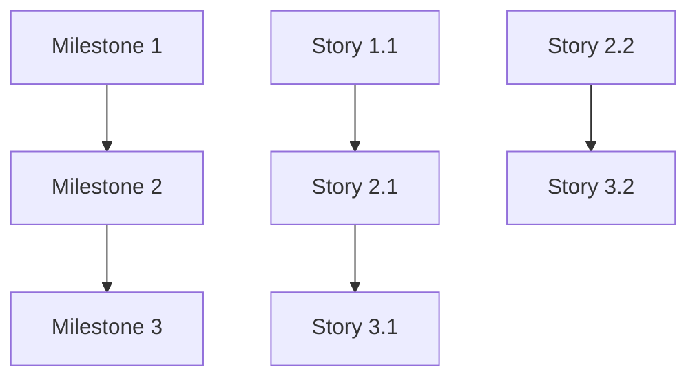

# Generate Tickets from Specs

**IMPORTANT**: This is an on-demand command that generates tickets/issues from your planning specs. Run this AFTER BUILD_MAP is complete and BEFORE or DURING implementation.

---

## STEP 1: DETECT SPEC_PATH

Read ${SPEC_PATH} from 00_START_HERE.md (look for "SPEC_PATH:" at the top).

If SPEC_PATH not found:
- Ask user: "What is your SPEC_PATH? (e.g., /specs/ or /specs/TICKET-ID/)"
- Set SPEC_PATH to user's answer

---

## STEP 2: LOAD ALL SPEC FILES

Read the following files from ${SPEC_PATH}:
- **00_START_HERE.md** - Project context, constraints
- **01_PRD.md** - Features, acceptance criteria, scenarios
- **02_ARCHITECTURE.md** - Technical stack, architecture decisions
- **03_DATA_MODEL.md** - Database schema, entities
- **04_API_CONTRACT.md** - API endpoints, contracts
- **05_UI_UX.md** - UI/UX requirements (if applicable)
- **07_SECURITY_NFR.md** - Security requirements
- **08_TESTING_RELEASE.md** - Testing approach
- **09_DECISIONS.md** - Key decisions and rationale
- **10_BUILD_MAP.md** - Milestones breakdown (PRIMARY SOURCE)

If any critical files are missing (especially BUILD_MAP.md):
- Error: "Cannot generate tickets without BUILD_MAP.md. Please complete planning first."
- Exit

---

## STEP 3: PARSE MILESTONES

From BUILD_MAP.md, extract:
- Milestone number and title
- Milestone description
- Acceptance criteria per milestone
- Time estimate (AI-assisted)
- Dependencies between milestones
- Quality gates

Example parsing:
```
MILESTONE 1: Project Setup & Environment (15-25 min)
→ Milestone title: "Project Setup & Environment"
→ Estimate: "15-25 min"
→ Dependencies: None (first milestone)
```

---

## STEP 4: GENERATE USER STORIES PER MILESTONE

For EACH milestone, determine story breakdown strategy:

### Strategy Decision (Auto-detect based on milestone size):

**IF milestone is small (< 1 hour estimate)**:
- Create 1 user story = 1 milestone
- No subtasks needed
- **Example**: "MILESTONE 1: Project Setup" → "Story 1: Set up project environment"

**IF milestone is medium (1-3 hours estimate)**:
- Create 2-4 user stories per milestone (feature-based breakdown)
- Subtasks optional
- **Example**: "MILESTONE 3: User Authentication"
  - Story 3.1: User Registration
  - Story 3.2: User Login
  - Story 3.3: Password Reset

**IF milestone is large (> 3 hours estimate)**:
- Create 3-6 user stories per milestone (hybrid breakdown)
- Include subtasks for each story (layer-based: API, UI, Tests)
- **Example**: "MILESTONE 5: Dashboard with Real-time Updates"
  - Story 5.1: Dashboard Data API
    - Subtask: Design GraphQL schema
    - Subtask: Implement resolvers
    - Subtask: Write API tests
  - Story 5.2: Dashboard UI Components
    - Subtask: Create dashboard layout
    - Subtask: Build data visualization widgets
    - Subtask: Write component tests
  - Story 5.3: Real-time WebSocket Integration
    - Subtask: Set up WebSocket server
    - Subtask: Implement client-side listeners
    - Subtask: Write integration tests

### Story Content Generation:

For each user story, generate:

**Title**: `[Milestone #.Story #] [Feature Name]`
- Example: `[M3.1] User Registration`

**Description** (Classic Agile format):
```markdown
**As a** [user type from PRD]
**I want to** [action/capability]
**So that** [benefit/value]
```

**Acceptance Criteria** (from PRD + BUILD_MAP):
```markdown
- [ ] [Criterion 1 from specs]
- [ ] [Criterion 2 from specs]
- [ ] [Criterion 3 from specs]
- [ ] Quality gate: All tests pass
- [ ] Quality gate: Linter passes
- [ ] Quality gate: [Any additional gates from 08_TESTING_RELEASE.md]
```

**Technical Details**:
```markdown
**Architecture**: [Relevant info from 02_ARCHITECTURE.md]
**Database**: [Relevant schema from 03_DATA_MODEL.md]
**API**: [Relevant endpoints from 04_API_CONTRACT.md]
**Security**: [Relevant requirements from 07_SECURITY_NFR.md]
**Files to modify/create**: [Estimated based on architecture]
```

**Dependencies**:
```markdown
**Blocks**: [Stories that depend on this one]
**Blocked by**: [Stories this depends on]
**Related to**: [Milestone dependencies from BUILD_MAP]
```

**Estimate**:
```markdown
**AI-assisted time**: [X-Y hours] (from BUILD_MAP milestone estimate / story count)
**Manual equivalent**: [W-Z hours] (3-5x slower)
**Complexity**: [Simple/Moderate/Complex from 00_START_HERE.md]
```

**Labels/Tags** (auto-generated):
```markdown
**Auto-tags**:
- `milestone-[N]` (e.g., `milestone-3`)
- `[tech-stack]` (e.g., `python`, `react`, `fastapi`)
- `[area]` (e.g., `backend`, `frontend`, `database`, `infrastructure`)
- `[type]` (e.g., `feature`, `bug`, `chore`, `docs`)
```

---

## STEP 5: GENERATE PREVIEW (Markdown)

Generate ${SPEC_PATH}TICKETS_PREVIEW.md with:

```markdown
# Ticket Generation Preview

**Project**: [From 00_START_HERE.md]
**SPEC_PATH**: ${SPEC_PATH}
**Total Milestones**: [N]
**Total Stories**: [M]
**Generated**: [Current date/time]

---

## Milestone 1: [Title] (Parent Ticket)

**Description**: [From BUILD_MAP]
**Estimate**: [X-Y hours AI-assisted]
**Dependencies**: None (or list)
**Tags**: `milestone`, `milestone-1`, [area tags]

### Story 1.1: [Title]

**As a** [user type]
**I want to** [action]
**So that** [benefit]

**Acceptance Criteria**:
- [ ] [Criterion 1]
- [ ] [Criterion 2]

**Technical Details**:
- Architecture: [Notes]
- Files: [List]

**Dependencies**:
- Blocked by: None
- Blocks: Story 2.1

**Estimate**: [X min] AI-assisted
**Tags**: `milestone-1`, `feature`, `backend`

---

[Repeat for all milestones and stories]

---

## Dependency Graph



---

## Summary Statistics

- **Total Milestones**: [N]
- **Total Stories**: [M]
- **Total Subtasks**: [K] (if applicable)
- **Total Estimated Time (AI-assisted)**: [X-Y hours]
- **Manual Equivalent**: [W-Z hours] (3-5x slower)
- **Complexity**: [Simple/Moderate/Complex/Very Complex]
```

Present preview to user:
**"I've generated a preview of [M] user stories across [N] milestones. Review ${SPEC_PATH}TICKETS_PREVIEW.md"**

🛑 **WAIT FOR USER APPROVAL**

Ask: "Does this ticket structure look correct? (yes/no/modify)"

**IF modify**: Ask what needs to change, regenerate preview, wait for approval again
**IF no**: Exit without creating tickets
**IF yes**: Continue to Step 6

---

## STEP 6: QUERY INTEGRATION TARGET

Ask user: **"Where should these tickets be created?"**

Present options:
- **Option A - Linear** (via Linear MCP server)
  - Native milestone support
  - Issue linking to parent milestones
  - Custom fields support
  - Dependencies (blocks/blocked by)

- **Option B - GitHub Issues** (via gh CLI or GitHub MCP)
  - Native milestone support
  - Issue references for dependencies
  - Labels for categorization
  - Projects integration available

- **Option C - Jira** (via Jira MCP if available)
  - Epic/Story/Task hierarchy
  - Sprint assignment
  - Custom fields support

- **Option D - Export Only** (no integration)
  - Generate markdown files only
  - Generate JSON export for manual import
  - No API calls

- **Option E - Multiple Targets** (create in multiple systems)
  - Example: Linear + Export markdown for documentation

- **Option F - Cancel**
  - Exit without creating tickets

🛑 **WAIT FOR ANSWER**

Store answer as INTEGRATION_TARGET.

**IF Option F (Cancel)**: Exit gracefully

**IF Option D (Export Only)**:
- Save TICKETS_PREVIEW.md as TICKETS.md
- Generate TICKETS.json with all ticket data
- Skip to Step 10 (confirmation)

**IF Option A, B, C, or E**: Continue to Step 7

---

## STEP 7: QUERY TICKET METADATA

**IMPORTANT**: Ask these questions ONE AT A TIME (not all at once).

### Question 1: Labels/Tags

**Ask**: "What additional labels/tags should be applied to all tickets?"

**Context**: "I've auto-generated tags based on tech stack and milestone. You can add custom tags like 'sprint-5', 'high-priority', 'team-alpha', etc."

**Format**: Comma-separated list or "none" for auto-generated only

**Example input**: `sprint-5, high-priority, needs-review`

🛑 WAIT FOR ANSWER → Store as CUSTOM_TAGS

---

### Question 2: Sprint/Cycle Assignment

**Ask**: "Should these tickets be assigned to a sprint/cycle?"

**Options**:
- **Option A**: Specify sprint/cycle name or ID (e.g., "Sprint 5" or "Cycle 2025-01")
- **Option B**: Assign to backlog (no sprint)
- **Option C**: Ask per milestone (different milestones to different sprints)

**IF Linear**: Use cycle ID or name
**IF GitHub**: Use milestone or project board
**IF Jira**: Use sprint name

🛑 WAIT FOR ANSWER → Store as SPRINT_ASSIGNMENT

---

### Question 3: User Assignment

**Ask**: "Should these tickets be assigned to specific users?"

**Options**:
- **Option A**: Assign all to one user (enter username)
- **Option B**: Leave unassigned (assign later)
- **Option C**: Assign per milestone (different owners)
- **Option D**: Assign to team (if platform supports teams)

**IF Linear**: Use Linear username or email
**IF GitHub**: Use GitHub username
**IF Jira**: Use Jira account ID or email

🛑 WAIT FOR ANSWER → Store as USER_ASSIGNMENT

---

### Question 4: Priority

**Ask**: "What priority should these tickets have?"

**Options**:
- **Option A**: Derive from specs (use complexity: Simple=Low, Moderate=Medium, Complex=High, Very Complex=Urgent)
- **Option B**: Set all to same priority (Urgent/High/Medium/Low)
- **Option C**: Set per milestone (ask for each)

**Default**: Option A (derive from complexity)

🛑 WAIT FOR ANSWER → Store as PRIORITY_STRATEGY

---

### Question 5: Team Assignment (if applicable)

**Ask**: "Should these tickets be assigned to a specific team?"

**Options**:
- **Option A**: Assign to team (enter team name)
- **Option B**: No team assignment

**Only ask if platform supports teams (Linear, Jira)**

🛑 WAIT FOR ANSWER → Store as TEAM_ASSIGNMENT

---

### Question 6: Custom Fields (if applicable)

**Ask**: "Are there any custom fields to set?"

**Context**: "Linear and Jira support custom fields. Examples: 'Customer Impact', 'Technical Debt', 'Risk Level', etc."

**Options**:
- **Option A**: No custom fields
- **Option B**: Specify custom fields (key-value pairs)

**Format**: `field_name:value, field_name2:value2`

**Example**: `customer_impact:high, technical_debt:low`

🛑 WAIT FOR ANSWER → Store as CUSTOM_FIELDS

---

## STEP 8: CREATE TICKETS VIA MCP/API

### For Linear (via Linear MCP):

**Process**:
1. **Create Milestones** (use Linear milestone/project CRUD):
   ```
   For each milestone in BUILD_MAP:
     - Create milestone in Linear
     - Set title, description, estimate
     - Store milestone ID for linking issues
   ```

2. **Create Issues** (linked to milestones):
   ```
   For each user story:
     - Create issue in Linear
     - Link to parent milestone (use milestone ID)
     - Set description (As a... I want... So that...)
     - Add acceptance criteria as checklist
     - Set estimate (AI-assisted time)
     - Add labels (auto-generated + custom)
     - Assign to sprint/cycle (if specified)
     - Assign to user (if specified)
     - Set priority
     - Set custom fields
     - Store issue ID
   ```

3. **Create Subtasks** (if hybrid breakdown used):
   ```
   For each subtask:
     - Create as child issue or checklist item
     - Link to parent story
     - Set estimate (portion of story estimate)
   ```

4. **Link Dependencies**:
   ```
   For each dependency relationship:
     - Use Linear "blocks" relationship
     - Link issue A blocks issue B
     - Link issue C blocked by issue D
   ```

**Error Handling**:
- If MCP call fails, log error and continue with next ticket
- Track failed tickets for retry
- After all attempts, show summary of successes/failures

---

### For GitHub Issues (via gh CLI or MCP):

**Process**:
1. **Create Milestones**:
   ```bash
   gh issue milestone create "Milestone 1: [Title]" \
     --description "[Description]" \
     --due-date [Optional]
   ```

2. **Create Issues**:
   ```bash
   gh issue create \
     --title "[M3.1] User Registration" \
     --body "[Full description with acceptance criteria]" \
     --milestone "Milestone 3" \
     --label "milestone-3,feature,backend" \
     --assignee "@me" (or specified user)
   ```

3. **Link Dependencies** (via issue references):
   - Add "Blocks #123" in issue description
   - Add "Blocked by #124" in issue description

4. **Add to Project Board** (if specified):
   ```bash
   gh project item-add [project-id] --issue [issue-id]
   ```

---

### For Jira (via Jira MCP if available):

**Process**:
1. **Create Epics** (milestones):
   - Use Jira API to create epic
   - Set epic name, description, estimate

2. **Create Stories**:
   - Create story under epic
   - Set description, acceptance criteria
   - Link to epic

3. **Create Subtasks**:
   - Create subtask under story

4. **Set Dependencies**:
   - Use "blocks" link type

---

### For Export Only:

**Process**:
1. Save ${SPEC_PATH}TICKETS.md (final version of preview)
2. Generate ${SPEC_PATH}TICKETS.json:
   ```json
   {
     "generated": "2026-01-02T12:00:00Z",
     "spec_path": "/specs/AUTH-101/",
     "milestones": [
       {
         "id": "M1",
         "title": "Project Setup & Environment",
         "description": "...",
         "estimate_hours": "0.25-0.42",
         "stories": [
           {
             "id": "M1.1",
             "title": "Set up project environment",
             "user_type": "developer",
             "action": "set up project environment",
             "benefit": "can start implementing features",
             "acceptance_criteria": [...],
             "technical_details": {...},
             "dependencies": {...},
             "estimate_hours": "0.25-0.42",
             "tags": ["milestone-1", "chore", "infrastructure"],
             "priority": "medium",
             "subtasks": []
           }
         ]
       }
     ],
     "summary": {
       "total_milestones": 8,
       "total_stories": 15,
       "total_estimate_hours": "6-11"
     }
   }
   ```

3. Generate ${SPEC_PATH}TICKETS.csv for spreadsheet import:
   ```csv
   Milestone,Story,Title,Description,Acceptance Criteria,Estimate (hours),Tags,Priority,Dependencies
   M1,M1.1,"[M1.1] Setup Environment","As a developer...","- [ ] Git initialized...",0.25-0.42,"milestone-1,chore",Medium,"None"
   ```

---

## STEP 9: SAVE TICKET REFERENCES

Create ${SPEC_PATH}TICKETS_CREATED.md to track created tickets:

```markdown
# Created Tickets

**Integration**: [Linear/GitHub/Jira]
**Created**: [Date/Time]
**Created by**: AI Agent (Claude/Cursor)

---

## Milestone 1: [Title]

**Ticket ID**: [Linear ID or GitHub milestone #]
**URL**: [Direct link to milestone]
**Status**: Open

### Story 1.1: [Title]

**Ticket ID**: [Issue ID]
**URL**: [Direct link to issue]
**Status**: Open
**Assigned to**: [Username or "Unassigned"]
**Labels**: [List of tags]
**Dependencies**: Blocks [ID], Blocked by [ID]

---

[Repeat for all created tickets]

---

## Summary

- **Total Milestones Created**: [N]
- **Total Stories Created**: [M]
- **Total Subtasks Created**: [K]
- **Failed to Create**: [X] (see error log below)

## Errors (if any)

- Story [ID]: [Error message]
- [Retry instructions]
```

**IMPORTANT**: This file provides traceability between specs and tickets.

---

## STEP 10: CONFIRMATION MESSAGE

Display success message:

```
✅ Ticket generation complete!

Summary:
- Milestones created: [N]
- Stories created: [M]
- Subtasks created: [K] (if applicable)
- Integration: [Linear/GitHub/Jira/Export Only]
- Total estimate: [X-Y hours] AI-assisted

View created tickets:
- ${SPEC_PATH}TICKETS_CREATED.md (ticket IDs and URLs)
- ${SPEC_PATH}TICKETS_PREVIEW.md (full preview)
- ${SPEC_PATH}TICKETS.json (export data)

[IF Integration used]:
Direct links:
- Milestone 1: [URL]
- Milestone 2: [URL]
...

[IF errors occurred]:
⚠️ Warning: [X] tickets failed to create. See TICKETS_CREATED.md for details.

Next steps:
1. Review created tickets in [Linear/GitHub/Jira]
2. Adjust priorities, assignments, or estimates as needed
3. Start implementation with full-app-11-implement-milestone-n.md
```

---

## ADDITIONAL FEATURES

### Re-run / Update Support

If TICKETS_CREATED.md already exists:

**Ask**: "Tickets were previously created. What would you like to do?"

**Options**:
- **Option A**: Update existing tickets (sync changes from specs)
- **Option B**: Create new tickets (ignore existing)
- **Option C**: Cancel

**IF Option A (Update)**:
- Read existing ticket IDs from TICKETS_CREATED.md
- Compare current specs with previous generation
- Update ticket descriptions, acceptance criteria, estimates if changed
- Add comment to ticket: "Updated by AI agent on [date] - specs changed"

---

### Dependency Auto-Linking

**Auto-detect dependencies from BUILD_MAP**:

Example BUILD_MAP:
```
MILESTONE 2: Database Setup
- Acceptance Criteria: Database schema created
- Dependencies: Milestone 1 (Project Setup) must be complete

MILESTONE 3: User Authentication
- Dependencies: Milestone 2 (Database) must be complete
```

**Auto-link**:
- Story 2.1 "blocked by" Story 1.1
- Story 3.1 "blocked by" Story 2.1

**Also detect implicit dependencies**:
- If Story 3.2 mentions "uses user table from Story 2.1" → auto-link
- If API endpoint in Story 4.1 requires auth from Story 3.1 → auto-link

---

### Template Customization (Future Enhancement)

Allow users to customize ticket templates:

**${SPEC_PATH}.ticket-templates/story.md**:
```markdown
---
platform: linear
---

## {title}

**As a** {user_type}
**I want to** {action}
**So that** {benefit}

**Acceptance Criteria**:
{acceptance_criteria}

**Technical Details**:
{technical_details}

**Estimate**: {estimate} hours (AI-assisted)

**Tags**: {tags}
```

If template exists, use it. Otherwise, use built-in default.

---

## BEST PRACTICES

### When to Run This Command

**RECOMMENDED**:
- After PLAN_APPROVAL_GATE (full-app-10a) is approved
- Before starting Milestone 1 implementation
- Gives team visibility into all work ahead

**ACCEPTABLE**:
- After each milestone completion (create tickets incrementally)
- When planning changes (regenerate/update tickets)

**NOT RECOMMENDED**:
- Before BUILD_MAP is complete (nothing to generate from)

---

### Ticket Granularity Guidelines

**Good Story Size** (easy to complete in 1 session):
- 0.5-3 hours AI-assisted
- 1-3 acceptance criteria
- Single feature or capability

**Too Large** (split into multiple stories):
- > 4 hours AI-assisted
- > 5 acceptance criteria
- Multiple unrelated features

**Too Small** (combine with other work):
- < 15 min AI-assisted
- 1 acceptance criterion
- Trivial change

**Auto-split large milestones**:
- If milestone > 4 hours → create 3-6 stories
- If milestone > 8 hours → create 6-10 stories with subtasks

---

### Handling Edge Cases

**IF no acceptance criteria in BUILD_MAP**:
- Fall back to 01_PRD.md acceptance criteria
- Generate generic criteria: "Feature works as described", "Tests pass", "Code reviewed"

**IF no time estimate in BUILD_MAP**:
- Estimate based on complexity from 00_START_HERE.md
- Simple: 0.5-1 hour, Moderate: 1-3 hours, Complex: 3-6 hours

**IF multiple teams work on same milestone**:
- Ask user: "Milestone [N] involves [frontend + backend]. Split into team-specific stories?"
- If yes, create separate stories per team

---

## TROUBLESHOOTING

### MCP Connection Issues

**Error**: "Cannot connect to Linear MCP"

**Solutions**:
1. Check MCP server is installed and running
2. Verify credentials/API keys are configured
3. Fall back to Export Only mode
4. Retry with different integration target

---

### Ticket Creation Failures

**Error**: "Failed to create Story 3.2 in Linear"

**Solutions**:
1. Log error with details
2. Continue with remaining tickets
3. Save failed tickets to retry list
4. At end, ask: "Retry failed tickets? (yes/no)"
5. If yes, retry with exponential backoff

---

### Duplicate Tickets

**Error**: "Ticket with this title already exists"

**Solutions**:
1. Check if TICKETS_CREATED.md exists
2. Ask user: "Update existing ticket or create new with different title?"
3. If update, use update flow
4. If new, append timestamp to title: "[M3.1] User Registration (2026-01-02)"

---

## NOTES

- **No code changes**: This command only creates tickets, does not modify application code
- **Idempotent**: Can re-run safely (will ask before creating duplicates)
- **Platform-agnostic**: Works with Linear, GitHub, Jira, or export-only
- **Spec-driven**: All content generated from planning specs, no manual input needed (except metadata)
- **Traceability**: TICKETS_CREATED.md links specs to tickets for future reference
- **Flexible**: Supports small (1 story/milestone) to large (6+ stories with subtasks) breakdowns

---

**NEXT STEP**: After tickets are created, proceed to Milestone 1 implementation using `full-app-11-implement-milestone-n.md`
